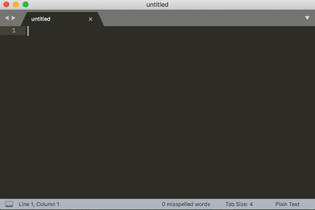

# Custom LaTeX snippets for use in Sublime Text

[Sublime Text's][st] built-in LaTeX package already includes a good number of snippets. This repository includes a few that are complimentary to the built-in package. See [how-to install](https://github.com/ckunte/latex-snippets-st#how-to-add-these-snippets-to-sublime-text) below.

This repository contains the following custom snippets:

| Snippet                   | Description                  |
| ------------------------- | ---------------------------- |
| `note` + <kbd>tab</kbd>   | Inserts a note template      |
| `paper` + <kbd>tab</kbd>  | Inserts a paper template     |
| `sum` + <kbd>tab</kbd>    | Inserts a summary block      |
| `toc` + <kbd>tab</kbd>    | Inserts a TOC block          |
| `em` + <kbd>tab</kbd>     | Emphasis snippet             |
| `sc` + <kbd>tab</kbd>     | Small caps snippet           |
| `fig` + <kbd>tab</kbd>    | Inserts a figure block       |
| `letter` + <kbd>tab</kbd> | Inserts a letter template    |
| `tabl` + <kbd>tab</kbd>   | Inserts a table block        |
| `ref` + <kbd>tab</kbd>    | Inserts a reference block    |
| `apdx` + <kbd>tab</kbd>   | Inserts an appendix block    |
| `pdf` + <kbd>tab</kbd>    | Inserts an `includepdf` line |
| `tsub` + <kbd>tab</kbd>   | Inserts textsubscript        |
| `tsup` + <kbd>tab</kbd>   | Inserts textsuperscript      |

## How snippets work

Type a pre-defined keyword, say, `fig` and press <kbd>tab</kbd>, and it produces a full block of figure LaTeX code. See a demonstration below.

## How to add these snippets to Sublime Text

This is done in two steps, viz., (a) add a repository and then (b) activate it. The how to is described below.

1. From _Tools > Command Palette..._ type _Add Repository_, and in the input box, enter `https://github.com/ckunte/latex-snippets-st`
2. From _Tools > Command Palette..._ type _Install Package_, and in the result list, type `latex-snippets-st` and select the thus found package.

## How to upgrade 

From _Tools > Command Palette..._ type _Upgrade Package_, and select one of the two options presented (i.e., _Package Control: Upgrade Package_ or _Package Control: Upgrade/Overwrite All Packages_).

* * *

## Keyboard shortcuts to emphasise selected text in Sublime Text

Writing down Sublime Text key-bindings for common triggers that have escaped my attention, despite years of writing. In the table below, depending on OS and keyboard layout,[^1] <kbd>super</kbd> is either <kbd>win</kbd> or <kbd>cmd</kbd>.

| Key combination                                    | Result                                     |
| -------------------------------------------------- | ------------------------------------------ |
| <kbd>super</kbd> + <kbd>shift</kbd> + <kbd>b</kbd> | Bold (wraps text in `\textbf{}`)           |
| <kbd>super</kbd> + <kbd>shift</kbd> + <kbd>i</kbd> | Italics (wraps text in `\emph{}`)          |
| <kbd>super</kbd> + <kbd>shift</kbd> + <kbd>k</kbd> | Small caps (wraps text in `\textsc{}`)     |
| <kbd>super</kbd> + <kbd>shift</kbd> + <kbd>7</kbd> | Tele-type text (wraps text in `\texttt{}`) |

Here's a demo.

<figure>
  <video src="https://user-images.githubusercontent.com/177423/239564730-68db67a9-56de-4265-a4f1-b58290e31ac1.mov" data-canonical-src="https://user-images.githubusercontent.com/177423/239564730-68db67a9-56de-4265-a4f1-b58290e31ac1.mov" controls="controls" muted="muted"></video>
  <figcaption>LaTeX key-bindings in action in Sublime Text.</figcaption>
</figure>

This is now enabled by the included sublime key file in the package.

[st]: https://www.sublimetext.com "Text editing done right."
